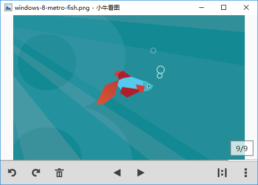

Niv
===

A fast compact image viewer on Windows

You can download the [setup](http://jarvisniu.com/niv/Niv_Setup_v0.4.2.exe)
file or just download the [executable](https://raw.githubusercontent.com/jarvisniu/Niv/master/exe/Niv.exe) file.

## Supported Formart

- .jpg/.jpeg
- .png
- .gif
- .bmp
- .ico
- .tif/.tiff

## Usage

The current version hasn't support file extension register, 
so you need to set it manually by following these steps:

1. Right click on the image file;
2. Select `Open With`;
3. Click `Choose Other Program` if `Niv.exe` does not appear in the list;
4. Find the `Niv.exe` executable file and choose it;
5. Click `Open`.

## Licence

MIT
